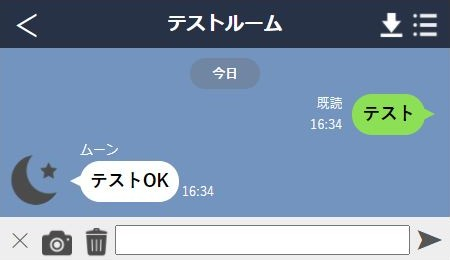
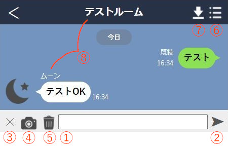

# これは何？
[「ナコさんのブログ | nako-log」様](https://nakox.jp/web/coding/chat_line_css)のLine風画面のCSSをベースに、自分用に魔改造して作ったLine画面作成&再生ツールです。  
使いたい画像のあるフォルダにフォルダごとコピーするだけで動きます。

# 使い方
## 作成ツール(_create.html)の使い方

適当にポチポチしてたら分かると思いますが、  
文字を入れたり、画像を入れたり、保存したりできます。  
詳細は以下の通り、  

1. 文字入力フォーム
2. 送信ボタン（Enterキーも同じ動作をします）
3. 発言者設定ボタン：＋の時は自分、×の時は相手
4. 画像送信ボタン：デフォルトは一つ上の階層(本フォルダを配置している場所)の画像のみ表示可能
    文字入力フォームに画像をドロップ&ドラッグでも送信可能
    （画像のFolderPathはhtml冒頭のscriptに記載）
5. 直前の発言を削除する
6. 時間設定ボタン：発言時間を変更するフォームを出現させる。
    hhmmの形式で時間差を指定。よくバグる
7. ダウンロード：現在の状態を「ルームの名前.html」で保存。開きなおして編集や再生が出来る
8. 名前：html冒頭のscriptで変更可能。分からない人はhtmlをメモ帳で開けばなんとなく分かる

## 再生モードについて

作成ツールで保存したhtmlファイルを開くことで、自動的に再生モードに移行  
送信ボタンもしくはEnterキーを押すことで開始＆自発言  
待てない人は、左上の上の**＜**を押すことで、最後までスキップ  
最後まで行った状態であれば作成モードと同様の操作が可能です  
